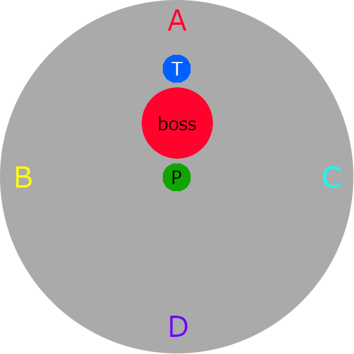
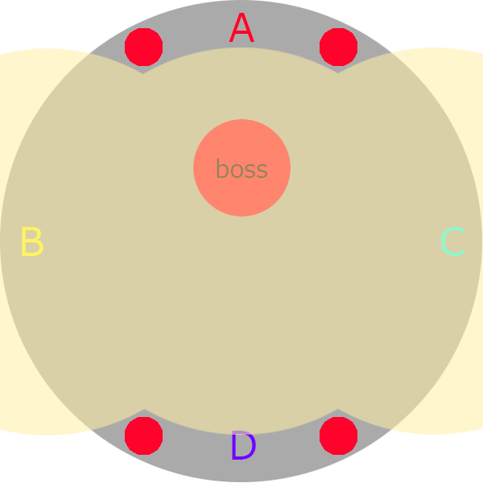
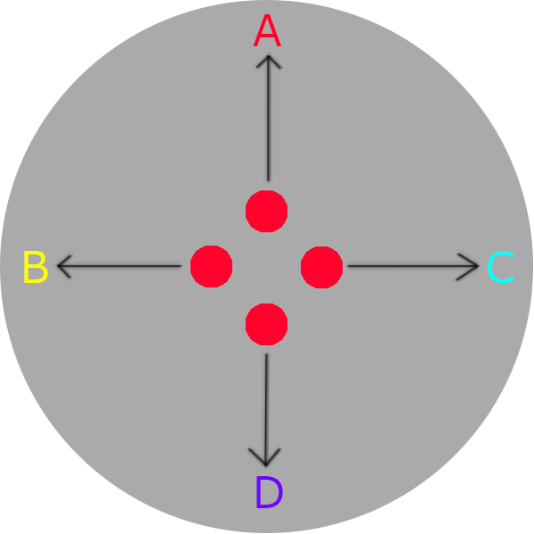

# Deltascape v2.0 (Savage)

## Before the fight:

Markers should be placed in the four cardinal directions. Each party member should be assigned one of these four markers in order to handle several of the mechanics that occur throughout the fight. 

One tank or healer and one DPS should be assigned to each marker like so: 

* A – Tank #1, DPS #1 
* B – Tank #2, DPS #2 
* C – Healer #1, DPS #3 
* D – Healer #2, DPS #4 

> T = tank, P = party

The boss should be tanked near the center, with the rear facing the center of the room where the rest of the party will be stacked.

## Boss abilities & strategy

### Earthquake
Huge AoE damage + a vulnerability stack.  Hits anyone on the ground.  Everyone should float to avoid it.

### 100Gs
 The top two party members on the enmity list are targeted by this.  A blue ball/aoe circle will appear on them.  

After a few seconds, any floating party member standing within the aoe circle will be forced to the ground. 

It is important that everyone is always hit by this ability in order to correctly handle the mechanics that follow it. 
 
### Gravitational Wave
 Moderate unavoidable AOE damage.  Heal as necessary.

### Aetherial Rift
 A large purple pool covers the entire arena.  After a few seconds, anyone on the ground will be killed.  Float to avoid this.

This attack immediately follows the double stack explosion of Gravitational Manipulation.

Anyone who isn’t already floating should immediately use the levitation device to avoid this.

### Evilsphere
 A moderate damage tankbuster.  Mitigate as normal. Tanks should swap immediately after this hit (though this swap is actually due to a separate mechanic).

### Gradual Petrification
 Moderate damage cleave that applies a stacking debuff. If this debuff reaches three stacks, the target will be instantly killed.  

Catastrophe does two of these before Evilsphere, and the third shortly after.  Thus, the tanks should swap after Evilsphere to avoid death.

### Death’s Gaze
 Point blank AoE instant-death gaze attack.  Look away to avoid it.

### Antilight
Large blue and yellow AOE circles appear on the ground and floating in the air, respectively. 

There is a safe spot in the very center of the room which will avoid this. 

For the first Antilight, nobody can be floating as the yellow circles overlap the center.  For the second, it is OK to float (and some party members should do so – explained later).

### Gravitational Manipulation (with Blue and Yellow stack markers)
Before the stack markers explode, one person will be forced to float and one person (if already floating) will be forced to the ground.

Four people must be hit by each attack in order to avoid vulnerability debuffs – thus, four people should be floating and four should be on the ground.

The easiest way to handle this mechanic is to have four people floating before Gravitational Manipulation goes off - either have the tanks + healers or all four DPS do this.  One person will be forced down and one will be force up, but there will still be four floaters and four on the ground after the swap. After Gravitational Manipulation explodes, the remaining grounded players will immediately need to levitate to avoid **Aetherial Rift**.

### Maniacal Probe
 Four people will be targeted with a red eye marker.  For the first set, it will be healers + tanks.  For the second set, it will be all four DPS.

People targeted by this should run to their designated markers and wait there.  After a few seconds, tentacles will spawn directly beneath the marked players.

The tentacles function similarly to the Judgement Crystals in A12s and serve as detectors for another move the boss does called Epicenter.

During this mechanic, you will also need to look away from the boss to avoid **Death's Gaze**.

### Epicenter
Massive AoEs that appear in 2-3 of the cardinal directions around the room.  This deals heavy damage and places a vulnerability debuff on anyone struck.

The tentacles placed by Maniacal Probe serve as detectors to this mechanic. Blue eyes will float above each of the tentacles at first.  After a few moments, if properly placed, the first tentacle to lose its blue marker is the safe zone. All other tentacles are NOT safe.

The entire party needs to run to the safe zone, as close to the wall as possible, in order to avoid being hit by epicenter. This mechanic also coincides with either a 100G (first time) or a Gravitational Manipulation (second time), so the entire party should stack at the safe zone and handle these mechanics as they would normally.

### -100Gs
Blue and yellow AoE circles will appear and cover a huge portion of the center of the arena, spanning from the east all the way to the western edge of the room.

When he finishes casting -100Gs, everybody will be sent flying. If you aren’t standing in a safe spot before it goes off, you will probably die.

The safe spots are in the north and south. Both tanks and two DPS (pre-assigned) should go north.  Both healers and the remaining two DPS should go south.

Three of the DPS will get AoE markers during this. DPS should stand on the east and west edges of the safe zones to avoid overlapping the AoE.

During this mechanic, you will also need to look away from the boss to avoid **Death's Gaze**.

> DPS positions to leave safe room for tanks/healers during -100Gs

### Unstable Gravitation
 This is an 18 second long debuff.  When it wears off, anyone who has this will cause a massive AoE (about the size of Defamation from A12S) explosion for a large amount of damage (10-15k range).

Four players will receive this debuff when it goes out, and they should be in their predetermined mark location in one of the four cardinal directions when it goes off so that the AoEs don’t overlap. This will create a safe spot in the center of the room for players who do not have the debuff.  This is extremely vital because this coincides with another mechanic, Long Drop, which must be split between the entire party.

For its first appearance, tanks + healers will receive this debuff.  For the second, the four DPS will have it.

### Long Drop
Extreme damage AoE with a stack marker.  Everybody needs to get hit by this to split the damage amongst the party, along with shields and whatever physical damage debuffs you might have.

This occurs immediately after an Antilight, so everybody should already be stacked in the center.

What complicates this is that four players will have Unstable Gravitation during this time. Luckily, there is an easy way to resolve this.  Any party members who happen to be floating when struck by Long Drop will be knocked away.

Because of this, all party members with Unstable Gravitation should float, and stand slightly toward their marked position. 

If done correctly, each floating party member will be knocked into their respective mark position when struck, so they can split the damage with the party but also be out of range for when their Unstable Gravitation explodes.

> Players with Unstable Gravitation should use the Long Drop knockback to place themselves safely at the edge

# Timeline (Stolen from Reddit):

* Earthquake (float)
* OT forces 100g on party
* Antilight yellow and blue (STACK IN MIDDLE)
* AOE Damage
* Yellow/Blue stacking Gravitational Manipulation (4 grounded/4 floating) - 1 Heal and 1 DPS get tagged, must be diligent in calling out.
* Aetherial Rift (4 grounded need to float now)
* Catastrophe will do two conal AOEs to debuff tank (3rd will kill instantly)
* Evil Sphere (Swap during casting time)
* Catastrophe will do ONE conal AOE after evilsphere
* Maniacal Probe (Marked people go to specific spots -healer/tanks-) - Demon eye added
* Find Safe Zone, OT/MT force 100g on party
* AOE Damage
* Catastrophe will do two conal AOEs to debuff tank (3rd will kill instantly)
* Yellow/Blue stacking Gravitational Manipulation (4 grounded/4 floating)
* Evil Sphere (Swap during casting time)
* Catastrophe will do ONE conal AOE after evilsphere
* -100G Players are marked and must spread markers to prevent overlap and massive damage. Go north or south - Demon eye added
* MT/OT force 100g on party
* Antilight yellow and blue (STACK IN MIDDLE)
* Long Drop (Healers Tanks go in pre-determined ABCD directions -POP FLOAT- around boss and get pushed back to avoid stacking huge explosions)
* MT/OT force 100g
* Antilight Yellow
* Earthquake (pop float)
* MT/OT force 100g
* Maniacal Probe (Marked people go to specific spots -DPS-) - Demon eye added
* Find Safe Zone, - Yellow/Blue stacking Gravitational Manipulation (4 grounded/4 floating) - 1 Heal and 1 DPS get tagged, must be diligent in calling out.
* MT/OT force 100g
* Antilight yellow and blue (STACK IN MIDDLE)
* Long Drop (DPS go in pre-determined ABCD directions -POP FLOAT- around boss and get pushed back to avoid stacking huge explosions)
* MT/OT force 100g
* Antilight Yellow
* Maniacal Probe (Marked people go to specific spots -healer/tanks-) - Demon eye added
* Find Safe Zone, - Yellow/Blue stacking Gravitational Manipulation (4 grounded/4 floating) - 1 Heal and 1 DPS get tagged, must be diligent in calling out.
* MT/OT force 100g
* Antilight yellow and blue (STACK IN MIDDLE)
* Long Drop (Healers Tanks go in pre-determined ABCD directions -POP FLOAT- around boss and get pushed back to avoid stacking huge explosions)
* Aetheral Rift (4 grounded need to float now) - Demon Eye added
* MT/OT force 100g
* Antilight Yellow
* Catastrophe will do two conal AOEs to debuff tank (3rd will kill instantly)
* Evil Sphere (Swap during casting time)
* Catastrophe will do ONE conal AOE after evilsphere
* - Yellow/Blue stacking Gravitational Manipulation (4 grounded/4 floating) - 1 Heal and 1 DPS get tagged, must be diligent in calling out.
* Aetheral Rift (4 grounded need to float now)
* MT/OT force 100g
* Antilight Yellow
* Earthquake (pop float)
* AOE Damage
* -100G Players are marked and must spread markers to prevent overlap and massive damage. Go north or south - Demon eye added
* MT/OT force 100g
* Antilight Yellow
* Boss should be dead, will cycle mechanics until enrage

